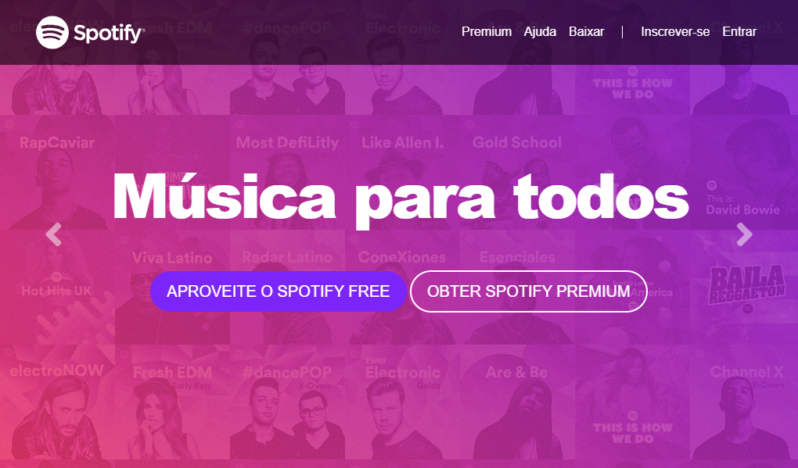

# SpotifyCloneUI
Bem-vindo ao repositório SpotifyCloneUI, um projeto que recria o visual da página inicial do Spotify usando tecnologias web como HTML, CSS e Bootstrap.

## Visão Geral

Este projeto é um clone do frontend do site do Spotify, projetado para oferecer uma experiência de usuário familiar, elegante e responsiva. Utilizando as melhores práticas de design e implementação, replicamos a aparência moderna e dinâmica do Spotify.

## Tecnologias Utilizadas

- **HTML5**: Estruturação semântica para uma base sólida.
- **CSS3**: Estilização para proporcionar uma experiência visual envolvente.
- **Bootstrap 4**: Framework para facilitar o desenvolvimento responsivo e aprimorar o design.

## Como Contribuir

1. Faça um fork do repositório.
2. Clone o fork para sua máquina local.
3. Faça suas modificações e adições.
4. Envie um pull request para análise.

## Estrutura do Projeto

- `index.html`: Página principal que representa a home do Spotify.
- `styles/`: Diretório contendo arquivos CSS personalizados.
- `img/`: Diretório para armazenar imagens.

## Como Utilizar

1. Abra o arquivo `index.html` em seu navegador.
2. Explore a página e experimente a interface familiar do Spotify.

## Agradecimentos

Agradecemos por contribuir para este projeto! Juntos, estamos criando uma versão incrível do frontend do Spotify. Sinta-se à vontade para reportar problemas, sugerir melhorias ou contribuir com código.

Divirta-se explorando o SpotifyCloneUI!